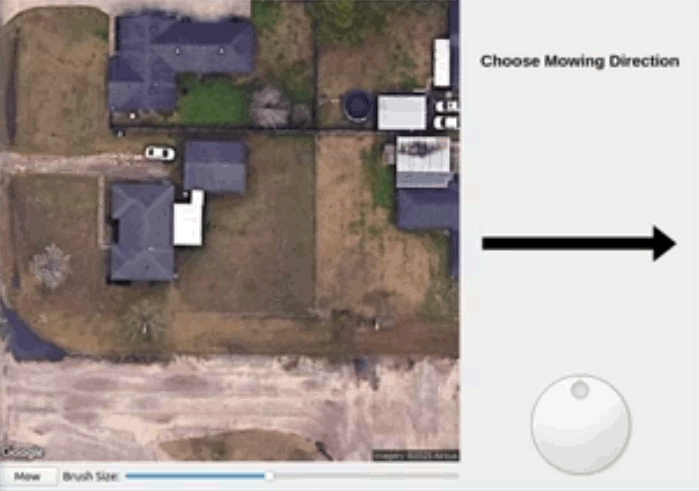

# 🎨 LawnPainter - The Robot Lawn Painting Applicaiton

## NOTE

This is the public repository for the Lawn Painter top level application for the LawnBot project.  Sensitive data like API keys and GPS locations have been removed, therefor in its current state will not function properly.  To get access and be added as a contributor to the project for viewing the private repo, please contact me through my LinkedIn.



LawnPainter is a python application that sits on top of the Nav2 ROS2 navigation stack.  It will allow the user to pull up their current GPS location and the related aerial photography from a maps service such as Google Maps API and then use a digital paintbrush to paint the areas on this map where the LawnBot is supposed to mow or cut.  This application is only a demonstration on how the cellphone application would work.  The user paints the areas, and then the application solves for the complete coverage path that would make the robot cover the complete area in precise back and forth motions in a given direction set by the user.  It will pass these waypoints to the navigation stack and monitor the progress of the mission visualizing the relevant data in realtime.  

---

## 🌱 Project Overview

For this demonstration to work you must have already setup ROS2 Humble and followed all installation instructions in the LawnBot repository (https://github.com/mwalden824/LawnBot).


### Software Dependencies

- Must have followed all setup instructions in [LawnBot](https://github.com/mwalden824/LawnBot) repo.
- Install python dependencies:
   ```bash
   pip install -r requirements.txt
   ```

### Getting Started

Once you have everything setup, just type:

1. **Launch LawnBot**
   ```bash
   ros2 launch lawn_bot lawn_bot_launch.py
   ```

2. **Run LawnPainter**

   ```bash
   python3 painter.py
   ```

Now use the GUI application to choose the size of your brush, then paint the area of the yard that you would like to cut.  The selected areas will turn a highlighted yellow color in order to show you where you have selected already.  Choose a direction with the know, and select the Mow button to begin the mission.  The program will calculate the required waypoints to carry out the mission and send them to the Nav2 stack over the network.  The progress of the mission is monitored and a green arrow appear showing the current location and orientation of the robot.

---

## 🚧 To Do

Here are some of the upcoming features and improvements that I am planning to implement:

- [ ] Need to modify solving algorithm so that it takes holes in the painted area into account correctly.
- [ ] Improve GUI style/look
- [ ] Implement this in an android application

---

## 📄 License

This project is licensed under the MIT License. See the [LICENSE](LICENSE) file for more details.

